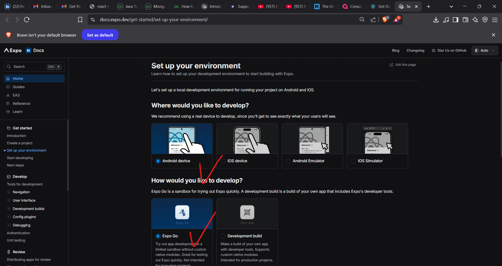
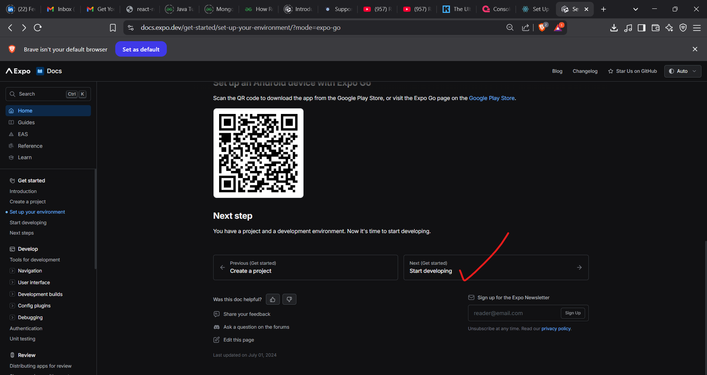
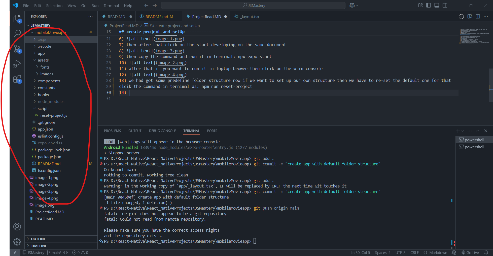
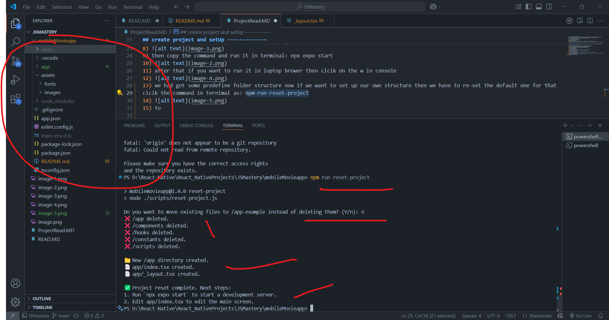
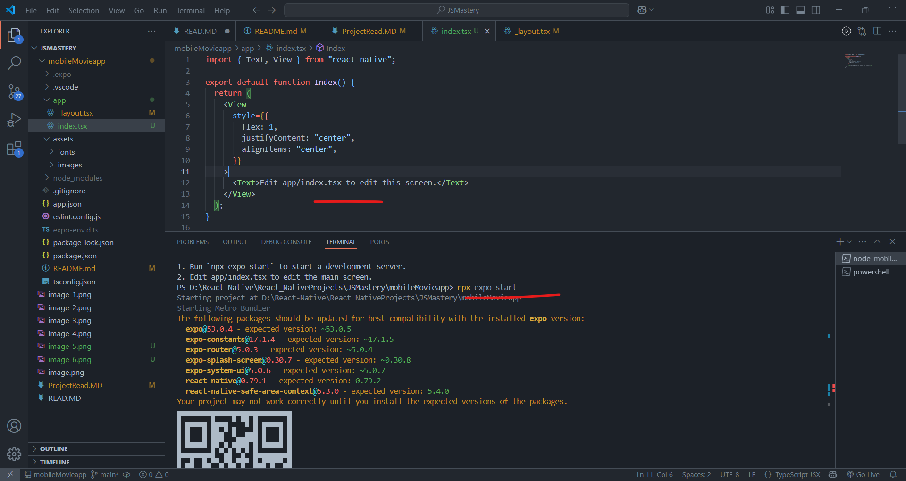
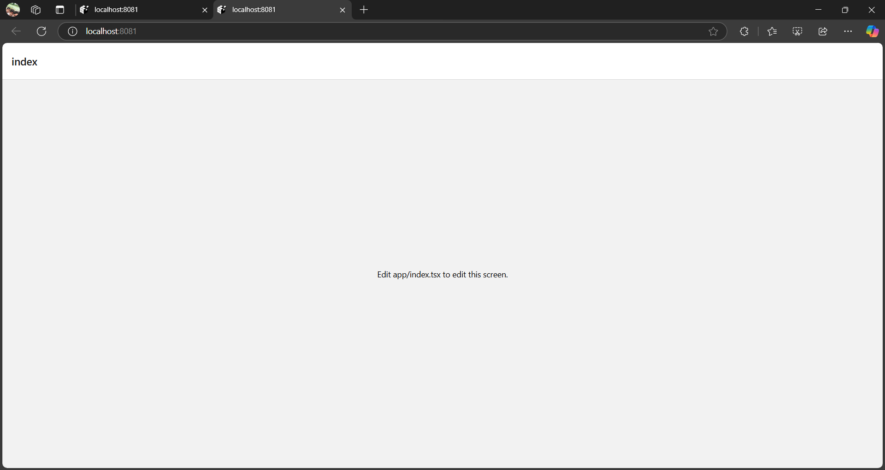

## ------- Project overview ---------
1) we will used the many components as StatusBar, FlatList, SafeAreView, Switch, Model, ScrollView, Aleert, 
2) core react native components like: View, Touchable, Image,FlatList, SafeAreView,TextInput etc.
3) differents navigations like: stack navigation, tab navigation 
4) custome Hook and font style.
5) type of interface using tylescript
6) resposvie desing(tailwings css)
7) Backend with appwrite
8) search feactures for smooth using thrid party api(TMDB) for smoth loading and handing
9) recommands system we will use the appwitre to store the user activity to store the data so that we can recommands 

## ---------------------------------
- creating account to appwrite website: https://cloud.appwrite.io/console/organization-6813b4560003f953db38

## create project and setUp -------------
1) go to react native website:https://reactnative.dev/docs/environment-setup
2) copy the command and paste in terminal: npx create-expo-app@latest
3) then again go to document and clcik on the continue with Expo
4) select the configuration based on device and your choice
5) 
6) 
7) then after that clcik on the start developing on the same document
8) 
9) then copy the command and run it in terminal: npx expo start
10) 
11) after that if you want to run it in loptop brower then clcik on the w in console 
12) 
13) we had got some predefine folder structure now if we want to set up our own structure then we have to re-set the default one for that 
clcik the command in ternimal as: npm run reset-project
14) 
15) to 
16) 
17) then start the application using: npm expo start 
18) 
19) 
20) now till now our project is runing but now our job is to setup the responsive feacacutre also in react js we are using the tailwings and here we will use the nativeWind for mobile application
21) 
