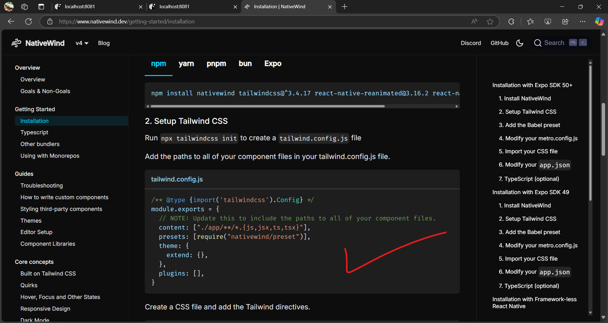
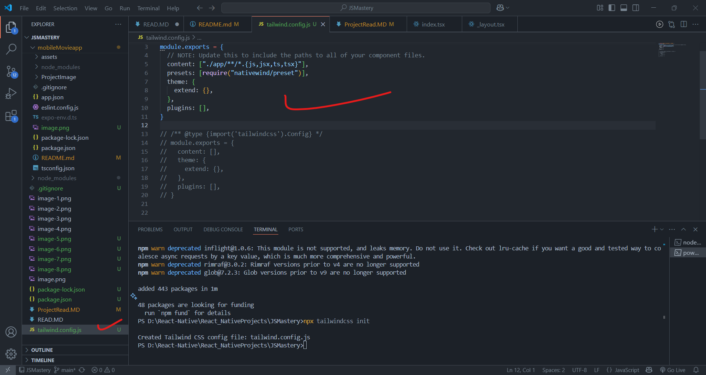
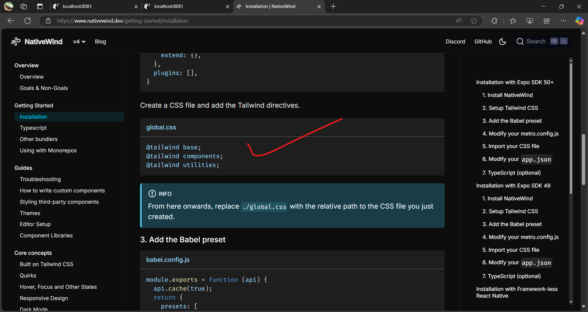
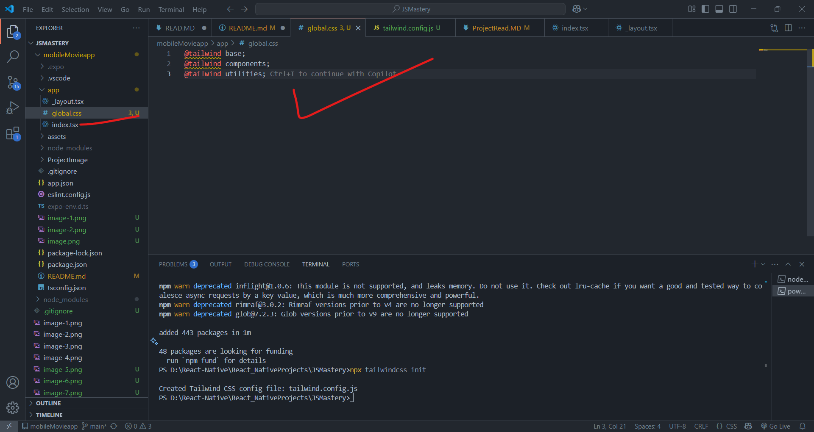
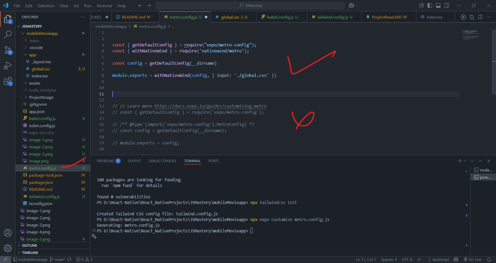
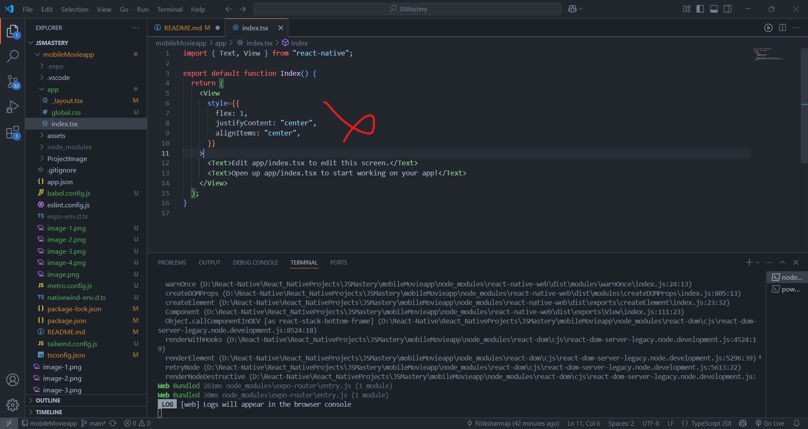
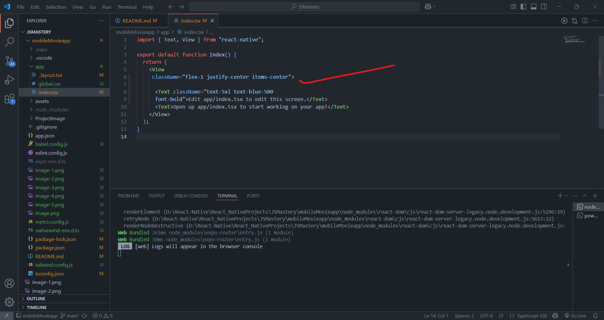
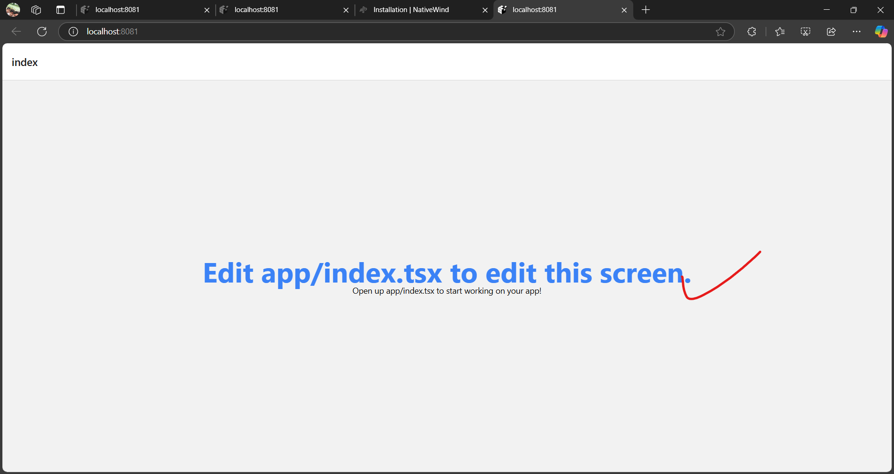
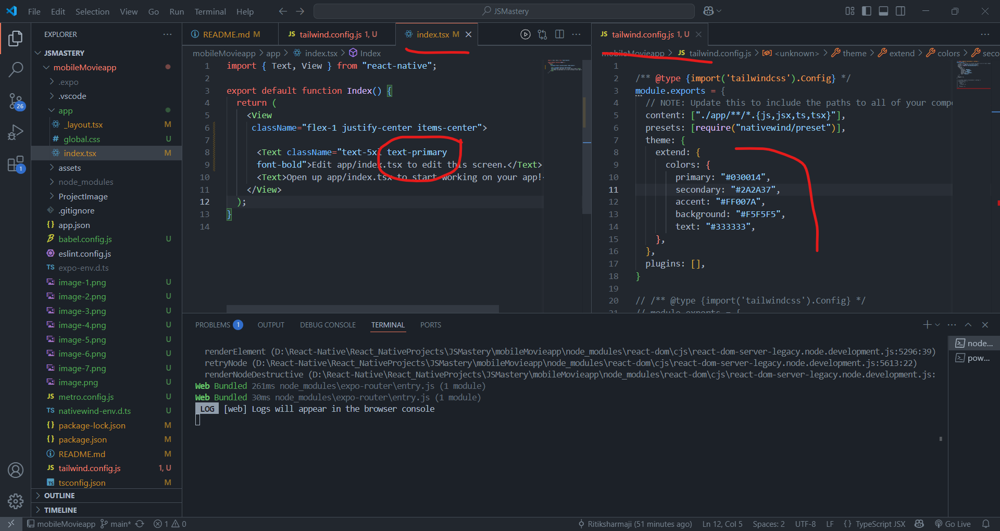
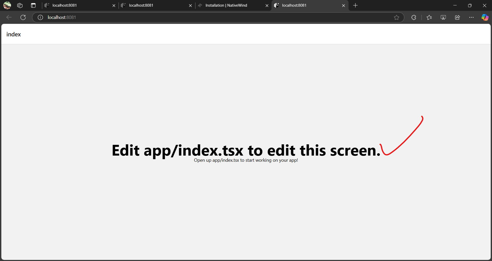

## ------- Project overview ---------
1) we will used the many components as StatusBar, FlatList, SafeAreView, Switch, Model, ScrollView, Aleert, 
2) core react native components like: View, Touchable, Image,FlatList, SafeAreView,TextInput etc.
3) differents navigations like: stack navigation, tab navigation 
4) custome Hook and font style.
5) type of interface using tylescript
6) resposvie desing(tailwings css)
7) Backend with appwrite
8) search feactures for smooth using thrid party api(TMDB) for smoth loading and handing
9) recommands system we will use the appwitre to store the user activity to store the data so that we can recommands 

## ---------------------------------
- creating account to appwrite website: https://cloud.appwrite.io/console/organization-6813b4560003f953db38

## create project and setUp -------------
1) go to react native website:https://reactnative.dev/docs/environment-setup
2) copy the command and paste in terminal: npx create-expo-app@latest
3) then again go to document and clcik on the continue with Expo
4) select the configuration based on device and your choice
5) 
6) 
7) then after that clcik on the start developing on the same document
8) 
9) then copy the command and run it in terminal: npx expo start
10) 
11) after that if you want to run it in loptop brower then clcik on the w in console 
12) 
13) we had got some predefine folder structure now if we want to set up our own structure then we have to re-set the default one for that 
clcik the command in ternimal as: npm run reset-project
14) 
15) to 
16) 
17) then start the application using: npm expo start 
18) 
19) 
20) now till now our project is runing but now our job is to setup the responsive feacacutre also in react js we are using the tailwings and here we will use the nativeWind for mobile application link for : https://www.nativewind.dev/
21) npm install nativewind tailwindcss react-native-reanimated react-native-safe-area-context 
22) after succeffull install above dependecy we need to configure the tailwings css to our porject for that run the command in ternimal as : npx tailwindcss init
23) copy the setup code from the website and paste in the tailwind.config.js file
24) 
25) 
26) create a gloable style file in app folder and paste the code 
27) 
28) 
29) now adding the Add the Babel preset: babel.config.js file
30) Modify your metro.config.js: for that first see either this file is there or not if not then run the commands as: npx expo customize metro.config.js then it will create this file then copy the code from the website and paste there.
31) 
32) create this file: nativewind-env.d.ts file to enable the type script to recognize the tailwinds css classes and previending etc. 
33) now close the application and again re-start with clear the data for that run the commands in ternimal as: npx expo start --clear
34) after runing the application in press w to run it in browesr after the if wnat to press r to reload tha application
35) now we can remove the css from the app.js and we can write the tailwinds css code as below
36) 
37) 
38) 
39) in place of giving each time color for each and every text and paragram and on we can define a constant color which will be used over our application for that we need to use the tailwind.config.js file in that in the theme: {
    extend: {},
  }, 
   in hte extend we need to define the color and the name which we will use in our application
40) 
41) 
42) 
## ----------- Routing & Navigation ------------------ 

